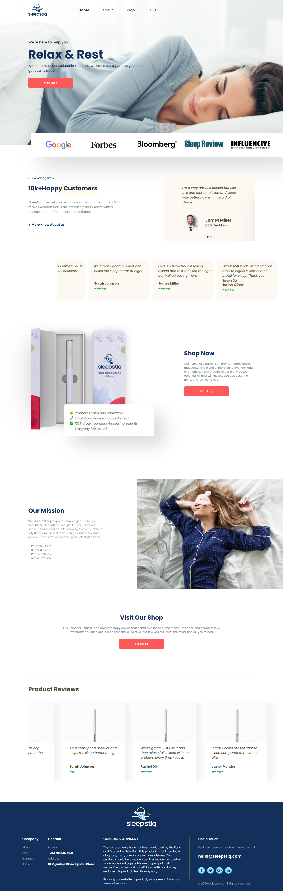
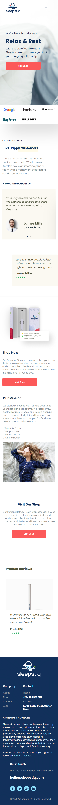

This is a website for sleepStiq

## Table of contents

- [sleepStiq](#sleepStiq)
  - [Screenshot](#screenshot)
  - [ScreenshotMobile](#ScreenshotMobile)
  - [Links](#links)
- [Author](#author)
- [Acknowledgments](#acknowledgments)

### sleepStiq

Users should be able to:

- View the optimal layout for the site depending on their device's screen size

### Screenshot

### ScreenshotMobile

### Links

- Solution URL1: [https://github.com/Dexie14/sleepStiq](https://github.com/Dexie14/sleepStiq)
- Solution URL2: [https://sleep-stiq-henna.vercel.app//](https://sleep-stiq-henna.vercel.app/)

## Author

- Github - [@Dexie14](https://github.com/Dexie14)
- Twitter - [@adeluadeoniye14](https://www.twitter.com/adeluadeoniye14)
- LinkedIn - [@adelu-adeoniye](https://www.linkedin.com/in/adelu-adeoniye/)

## Acknowledgments

🙂🙂
